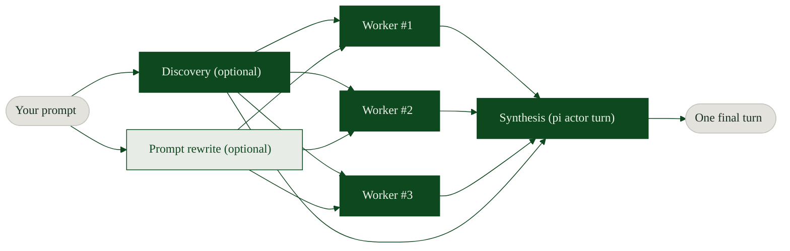

# pi-fusion

[English](README.md)

<p align="center">
  
</p>

<p align="center">
  <a href="https://github.com/leblancfg/pi-fusion/actions/workflows/ci.yml"></a>
  <a href="https://www.npmjs.com/package/@leblancfg/pi-fusion"></a>
  <a href="https://github.com/leblancfg/pi-fusion/blob/main/LICENSE"></a>
  <a href="https://pi.dev/packages/@leblancfg/pi-fusion"></a>
  <a href="https://leblancfg.com/pi-fusion/ja/"></a>
</p>

## インストール方法

npm からグローバル pi パッケージとしてインストールします。

```bash
pi install npm:@leblancfg/pi-fusion
```

GitHub リポジトリから直接インストールすることもできます。

```bash
pi install git:github.com/leblancfg/pi-fusion
```

pi を開き、設定ペインから有効化します。

```text
/fusion
```

**pi-fusion は pi に計画フェーズの fanout を追加します。** 通常の pi ターンが始まる前に、任意の discovery agent を実行し、プロンプトを相補的な観点に書き換え、planner worker へ並列に分配します。その後、各 worker のメモをメインスレッドへ戻し、最後に synthesis step として統合します。

独立したモデル応答を組み合わせる手法は、多くのベンチマークで個別の frontier model を上回ることが示されています。独立した試行は互いに異なる振る舞いをするため、synthesis model は 1 つの経路に賭ける代わりに、有用な不一致を再利用できます。

ケースによっては、より良い価格とレイテンシで frontier model を上回る性能を得られます。

<p align="center">
  
</p>

補足: OpenRouter には、複数モデルの panel と judge を 1 つの API route の背後で実行するホスト型 Fusion router (`openrouter/fusion`) があります。pi-fusion も考え方は似ていますが、こちらは作業ツリーに対してローカルの pi subprocess を実行し、そのメモを、あなたが既に選んでいる synthesis model に渡します。計画用 subprocess にすべての tools を与えるか、read-only tools だけを与えるかを含め、挙動はすべて設定できます。



## このプロジェクトの目的

Coding agent は、最初に見つけたもっともらしい計画に飛びつきがちです。単純作業ならそれで十分ですが、隠れた結合があるタスクでは危うくなります。`pi-fusion` は inference time に複数のモデル呼び出しを行い、1 つの統合された応答へ戻します。関連する用語としては、compound inference systems、inference-time scaling、test-time compute、model panels、multi-agent deliberation、Mixture-of-Agents などがあります。

すべての推論を、もっとも高価なモデルの長い直列チェーンの中だけで行う必要はありません。一部は、少し安いモデルや少し単純なモデルに並列で走らせ、その結果を 1 回の最終ターンに圧縮できます。

OpenAI の [o1 write-up](https://openai.com/index/learning-to-reason-with-llms/) は、test-time compute という軸をわかりやすく示しました。モデルに考える予算を追加すれば、より良い結果が出ることがあります。その次の問いは、予算の一部を、より長い hidden chain ではなく、より多くの呼び出し、より多くの sample、より多くの agent に使ったらどうなるか、です。

参考になる資料:

- Berkeley BAIR の
  ["The Shift from Models to Compound AI Systems"](https://bair.berkeley.edu/blog/2024/02/18/compound-ai-systems/)
  は、compound AI systems を、model calls、retrievers、tools、control logic など、相互作用する複数コンポーネントを使うシステムとして定義しています。
- Chen et al., ["Are More LLM Calls All You Need?"](https://arxiv.org/abs/2403.02419) は、複数の LM call を集約する compound inference systems の scaling law を扱っています。
- Snell et al., ["Scaling LLM Test-Time Compute Optimally"](https://arxiv.org/abs/2408.03314) は、inference-time compute を独立した scaling axis として整理しています。
- Brown et al., ["Large Language Monkeys"](https://arxiv.org/abs/2407.21787) は、反復 sampling が弱いモデルを増幅し、場合によっては費用対効果よく性能を上げられることを示しています。
- Wang et al., ["Mixture-of-Agents"](https://arxiv.org/abs/2406.04692) は、複数の LLM agent の出力を集約することで最終回答の品質が改善することを示しています。

私自身の eval でも、一部の coding task では、parallel planner calls が、すべてを最大モデルへ直接投げるより安く、wall-clock でも速く、品質も高い方向を示しています。常にそうなるわけではありません。このリポジトリの目的は、その主張を雰囲気のある構成図ではなく、実際に検証しやすい形にすることです。

## 画面で見えるもの

TUI mode では、fusion されたターンに live pane が表示されます。

1. **Discovery** が共有コンテキストを一度だけ読み込みます。
2. **Workers** が縦分割で表示され、それぞれ独自の prompt angle を持ちます。
3. planning bundle の準備ができると **Synthesis** が始まります。

便利な操作:

```text
/fusion   open settings
Esc       cancel the fanout and fall back to a normal turn
1-9       focus one worker column
0 / Tab   return to split view
p         show or hide rewritten worker prompts
```

また、次のターンで fusion が armed されているかどうかを示す 1 文字の status bar も表示されます。

## 使いどころ

向いているケース:

- 「バグを見つけたいが、どこにあるかわからない」
- 「ファイルを触る前に、このリファクタリング計画を立てたい」
- 「未知の領域をレビューして、最小の安全な変更を提案してほしい」
- 「実装方針をいくつか比較してから決めたい」

向いていないケース:

- 起動レイテンシが作業時間を上回るような小さな編集。
- 画像付きのプロンプト。synthesis turn は画像を見られますが、現時点では discovery と workers は見られません。
- stdout に進捗を出す必要がある完全な non-interactive run。`pi-fusion` は print/JSON output を壊さないよう、その場合は静かに動作します。

## 設定

設定ペインを開きます。

```text
/fusion
```

| Row            | 変更内容                                                                     |
| -------------- | ---------------------------------------------------------------------------- |
| Next turn      | 次の対象ユーザープロンプトだけ fusion を armed し、その後 off にします。     |
| Presets        | 現在のペイン設定を保存、保存済み設定を読み込み、または削除します。           |
| Workers        | worker 数を設定し、worker ごとの model 設定を開きます。                      |
| Agent tools    | discovery/workers に all tools を与えるか read-only にするかを切り替えます。 |
| Discovery      | context-loading model と reasoning effort を選びます。                       |
| Rewrite        | worker fanout の前に prompt rewriting を行うかを切り替えます。               |
| Synthesis      | synthesis model と reasoning effort を選びます。                             |
| Save and close | 設定を pi session に保存します。                                             |

Presets は、settings pane のユーザー定義 snapshot です。組み込み profile はありません。組み込み profile は古くなりやすく、前提を隠してしまうためです。`/fusion` → **Presets** から自分用の preset を保存してください。global preset は `~/.pi/agent/fusion.json` に、project preset は `.pi/fusion.json` に保存され、同名の場合は project preset が global preset を上書きします。完全な形式と例は [docs/ja/presets.md](docs/ja/presets.md) を参照してください。

status bar は短い union marker を使います。`∪̸` は fusion off、`∪` は次の対象ターンが armed されている状態です。

ローカル開発では TypeScript entrypoint を直接読み込みます。

```bash
pi -e ./extensions/pi-fusion/index.ts
```

公開パッケージは `package.json` の `pi.extensions` field を使います。別個の `index.json` manifest はありません。

再現可能な起動のために CLI flags も用意されています。

```bash
pi --fusion-workers 4 \
  --fusion-discovery-model anthropic/claude-haiku-4-5 \
  --fusion-worker-model anthropic/claude-sonnet-4-5 \
  --fusion-synthesis-model openai/gpt-5.2-codex
```

main session model を維持するには `current` を指定するか、model flag を省略します。reasoning 値は次のとおりです。

```text
current, off, minimal, low, medium, high, xhigh
```

## プロンプトのカスタマイズ

`pi-fusion` が使うすべてのプロンプトは完全にカスタマイズできます。初回実行時に、default prompts が global `fusion.json` (`~/.pi/agent/fusion.json`) へ自動的に書き込まれます。そこで確認・編集でき、project ごとに上書きすることもできます。

### プロンプトの保存場所

`pi-fusion` は 2 つの場所から prompt を読み込みます。

| Scope   | Path                      | 用途                                          |
| ------- | ------------------------- | --------------------------------------------- |
| Global  | `~/.pi/agent/fusion.json` | すべての project で使う default templates。   |
| Project | `.pi/fusion.json`         | チームで共有する project-specific templates。 |

project-level prompts は field ごとに global prompts を上書きします。pi-fusion は current working directory から上方向へ既存の `.pi/fusion.json` または `.git` directory を探すため、subdirectory から pi を起動しても repo-level config が見つかります。たとえば project file で `worker` だけを上書きし、global の `discovery`、`rewrite`、`actor` templates はそのまま使えます。

### JSON format

`fusion.json` の top level に `"prompts"` section を追加します。

```json
{
  "version": 1,
  "prompts": {
    "discovery": "...",
    "rewrite": "...",
    "worker": "...",
    "synthesis": "..."
  },
  "presets": {
    "cheap-planners": {
      "description": "Fast worker fanout, current model as synthesis",
      "settings": {
        ...
      }
    }
  }
}
```

### 利用可能な Prompts と Placeholders

各 prompt は単純な `{{placeholder}}` templating に対応しています。置換したい template tags を保持していれば、instruction text は並べ替え、書き換え、全面的な再フォーマットが可能です。

#### 1. Discovery Prompt (`prompts.discovery`)

この prompt は、discovery agent が codebase を探索するための指示です。

- **Placeholders:**
  - `{{cwd}}`: project の working directory。
  - `{{task}}`: 元の prompt。
  - `{{recentContext}}`: 整形済みの直近会話履歴。
  - `{{toolGuidance}}`: 選択された planner tool mode 用の整形済み guidance。

#### 2. Prompt Rewrite (`prompts.rewrite`)

この prompt は、rewrite model に worker prompts を生成させるために使われます。

- **Placeholders:**
  - `{{workerCount}}`: parallel workers の数。
  - `{{task}}`: 元の prompt。
  - `{{recentContext}}`: 整形済みの直近会話履歴。

#### 3. Worker Prompt (`prompts.worker`)

この prompt は各 parallel worker で実行されます。

- **Placeholders:**
  - `{{cwd}}`: project の working directory。
  - `{{task}}`: 元の prompt。
  - `{{assignedPrompt}}`: この worker 用に生成された rewritten prompt variation。
  - `{{discoveryContext}}`: discovery agent が読み込み、handoff した context。
  - `{{workerName}}`: slot index/name (例: `#1`, `#2`)。
  - `{{discoveryGuidance}}`: discovery context の使い方に関する整形済み guidance。
  - `{{toolGuidance}}`: 選択された planner tool mode 用の整形済み guidance。
  - `{{recentContext}}`: 整形済みの直近会話履歴。

#### 4. Synthesis Prompt (`prompts.synthesis`)

この prompt は、synthesis turn に注入される最終 planning bundle を整形します。

- **Placeholders:**
  - `{{task}}`: 元の prompt。
  - `{{discoveryContext}}`: discovery agent が読み込んだ context。
  - `{{variations}}`: worker prompt variations の一覧。
  - `{{workerOutputs}}`: 各 worker が生成した outputs と plans。
  - `{{imageNote}}`: 添付画像がある場合に、workers が画像を見ていないことを synthesis step へ伝える note。

> 💡 **Important:** synthesis prompt template には `<!-- pi-fusion:synthesis-prompt -->` を含めてください。これにより、後続の会話ターンは fused turn が完了したことを認識し、fusion を自動的に bypass できます。custom synthesis prompt がこれを省略した場合、pi-fusion は defensive に marker を先頭へ追加します。

## Commands

```text
/fusion                 # open floating settings pane
/fusion status
/fusion on              # arm fusion for the next eligible user prompt
/fusion off
/fusion preset list
/fusion preset save cheap-planners
/fusion preset save-project repo-review
/fusion preset cheap-planners
/fusion workers 4
/fusion tools all
/fusion tools read-only
/fusion discovery-model anthropic/claude-haiku-4-5
/fusion discovery-model current
/fusion discovery-thinking low
/fusion discovery-thinking current
/fusion worker-model google/gemini-3.5-flash
/fusion worker-model current
/fusion worker-thinking medium
/fusion worker-thinking current
/fusion synthesis-model openai/gpt-5.5
/fusion synthesis-model current
/fusion synthesis-thinking high
/fusion synthesis-thinking current
/fusion output 12000
/fusion context 16000
/fusion resume 8000
/fusion timeout 600000

/fusion-transcript                 # view the latest run's full archived transcript
/fusion-transcript list            # list archived runs in this session
/fusion-transcript <run-id>        # view a specific run
/fusion-transcript <run-id> --write transcript.md   # export to a file
```

`/fusion model ...` は `/fusion worker-model ...` の alias として引き続き利用できます。

## Startup flags

```bash
pi --fusion-enabled
pi --fusion-disabled
pi --fusion-preset cheap-planners
pi --fusion-workers 3
pi --fusion-planner-tools all
pi --fusion-discovery-model anthropic/claude-haiku-4-5
pi --fusion-discovery-thinking low
pi --fusion-worker-model google/gemini-3.5-flash
pi --fusion-worker-thinking medium
pi --fusion-synthesis-model openai/gpt-5.5
pi --fusion-synthesis-thinking high
pi --fusion-output-bytes 12000
pi --fusion-context-bytes 16000
pi --fusion-resume-bytes 8000
pi --fusion-timeout-ms 600000
```

fusion は default で off です。`--fusion-enabled` を使うと、次の対象ターンが armed された状態で開始します。`--fusion-disabled` は強制的に off にします。fused turn が始まると、`pi-fusion` は自動で disarm します。`--fusion-model` は後方互換のため `--fusion-worker-model` の alias として残っています。起動時に `~/.pi/agent/fusion.json` または `.pi/fusion.json` から preset を読み込むには `--fusion-preset NAME` を使います。planner subprocesses は default ですべての tools を使えます。元の狭い read/search/list tool set に戻すには `/fusion tools read-only` または `--fusion-planner-tools read-only` を使います。

## どこへ何が送られるか

fusion が armed されている場合、次の idle かつ non-command な user input がその arm を消費し、次を実行します。

- TUI mode で live discovery pane を開く。
- discovery と並行して query rewriting を実行する。
- discovery 完了後、live worker splits へ置き換える。
- JSON print mode で standalone `pi` subprocesses を開始する。
- subprocesses 内でも他の extensions は有効のままにする。pi-fusion だけが `PI_FUSION_SUBAGENT` env var により opt out するため、workers は recursive fusion なしでインストール済み extensions を利用できる。
- discovery と workers には、通常の all tools (default) または read/search/list tools (`read`, `grep`, `find`, `ls`) のみを与える。
- query rewriting には tools を与えない。
- shared discovery context をすべての worker prompt に注入する。
- workers に concise planning markdown を求める。
- `before_agent_start` を通じて、最終 planning bundle を synthesis turn の system prompt に挿入する。

user message は session 内で変更されません。`/tree` と `/fork` は元の prompt を表示し続け、planning bundle は turn をまたいで蓄積しません。fusion はその後自動的に off に戻るため、再度 arm しない限り次の prompt は通常どおり実行されます。

## Session archive と resume

すべては 1 つの pi session file の中で起こるため、fused turn は audit と resume が可能な状態で残ります。これは production や long-running workload で重要です。

各 fused turn は session tree に 2 種類の情報を書き込みます。

- **完全な archive。** discovery、rewrite、worker transcript の完全版、かつ未切り詰めの内容が `pi-fusion-archive` の `custom` entries として保存されます。storage のために chunk 分割はされますが、semantic truncation はされません。pi の context builder は `custom` entries を model に渡さないため、archive は full-fidelity のまま context window を増やしません。各 run には sort 可能な `run-id` が付与されます。
- **bounded handoff。** 1 つの `custom_message` が、worker conclusions の budgeted summary と archive `run-id` への pointer を保持します。resume 後や後続ターンが実際に見る fusion content はこれだけで、`fusion-resume-bytes` (default `8000`) により上限が設定されます。

結果として、session を resume したとき、model は raw sub-agent dumps ではなく、有用でコンパクトな handoff を受け取ります。一方で、完全な transcript は audit、表示、export のために disk 上へ残ります。`/fusion-transcript` でいつでも確認でき、`--write <path>` を付けると export できます。archive は `custom` entries にあるため resume 後も残りますが、通常の `/tree` conversation flow からは filter out されます。

synthesis turn 自体は worker output のより大きな slice (`fusion-output-bytes`) を見ます。durable かつ in-context な handoff だけが `fusion-resume-bytes` で clamp されます。

## Bypass されるケース

fusion は次の場合に skip されます。

- slash commands と prompt templates (`/...`)。
- user bash (`!...`)。
- extension-injected input。
- agent 実行中に queue された steering または follow-up messages。
- すでに fusion synthesis prompt である prompts。
- fusion が off/disarmed の turn。

これらの skip により、extension の挙動は予測しやすくなり、recursion も避けられます。

## Context budget

synthesis turn に挿入される worker output は worker ごとに上限があります (`fusion-output-bytes`, default `12000`)。discovery と workers に送られる recent conversation context は別に上限があります (`fusion-context-bytes`, default `16000`)。discovery tool-result context は downstream へ共有される前に制限されます。

3 つの byte budget は、3 種類の audience を分離するためのものです。

- `fusion-output-bytes` (default `12000`) — synthesis turn の prompt に挿入される worker output。
- `fusion-resume-bytes` (default `8000`) — resume 後や後続ターンの context に残る worker conclusions (durable handoff)。
- `fusion-context-bytes` (default `16000`) — discovery と workers に送られる recent conversation。

完全な worker transcripts は session file に non-context archive entries として保存されます ([Session archive と resume](#session-archive-と-resume) を参照)。`/fusion-transcript` で復元できますが、自動的に context window へ入ることはありません。

## 現時点の制約

- Discovery、rewrite、worker planning は、fanout が完了する、timeout する、または `Esc` で cancel されるまで turn を block します。
- Discovery と workers は真の pi session fork ではなく subprocess です。直近会話の truncated text snapshot を受け取り、full output は live sub-session としてではなく、後で parent session に archive されます。
- Discovery と workers は添付画像を見られません。
- Worker subprocesses は `AGENTS.md` など通常の pi context files と、インストール済み extensions を読み込みます。pi-fusion だけは `PI_FUSION_SUBAGENT` により内部で inert になります。
- live split pane は TUI mode のみで表示されます。Print、JSON、RPC mode でも fusion は実行されますが、この UI は表示されません。
- Print、JSON、RPC mode では意図的に progress output を出しません。これらの mode では stdout が消費される payload だからです。
- 不正な `fusion.json` は extension を crash させずに無視されます。presets や prompts が予期せず見つからない場合は JSON syntax を修正してください。
- provider によっては reasoning stream を隠すため、reasoning を有効にしていても worker column に reasoning が表示されない場合があります。
- Discovery と worker tool access は default で all tools です。subprocess に write-capable tools を実行させたくない planning pass では read-only planner tools を使ってください。
- 現在の pipeline は synthesis turn の前に 2 回の LLM round trip を使います。将来は軽量 mode が追加されるかもしれませんが、今は明示的な flow のほうがテストに向いています。

## Development

```bash
pnpm install
pnpm run check
```

より絞った checks:

```bash
pnpm test
pnpm run typecheck
pnpm run smoke
```

Project shape:

```text
extensions/pi-fusion/
  fusion.ts   # pure logic: settings, prompts, parsing, bypass
  index.ts    # subprocess fanout, lifecycle hooks, commands
  ui.ts       # TUI settings pane and live worker panel
tests/        # node:test tests for fusion.ts
scripts/      # smoke test
```

## Package shape

この package は standalone です。1 つの pi extension を宣言します。

```json
{
  "pi": {
    "extensions": ["./extensions/pi-fusion/index.ts"]
  }
}
```

## Links

- Docs site: <https://leblancfg.com/pi-fusion/ja/>
- pi package gallery: <https://pi.dev/packages/@leblancfg/pi-fusion>
- pi extension docs: <https://pi.dev/docs/extensions>
- Issues: <https://github.com/leblancfg/pi-fusion/issues>
