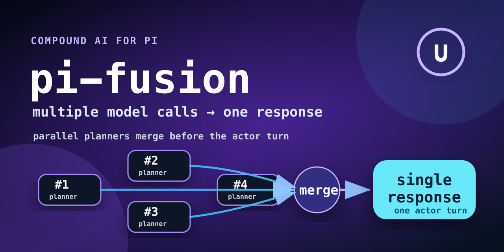
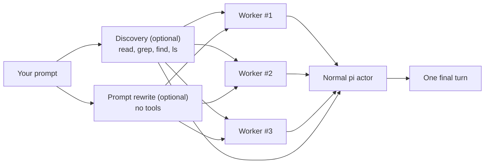

# pi-fusion

<p align="center">
  
</p>

<p align="center">
  <a href="https://github.com/leblancfg/pi-fusion/actions/workflows/ci.yml"></a>
  <a href="https://github.com/leblancfg/pi-fusion/blob/main/LICENSE"></a>
  <a href="https://pi.dev/packages/@leblancfg/pi-fusion"></a>
  <a href="https://leblancfg.com/pi-fusion/"></a>
</p>

## How to install

Install as a global pi package from npm:

```bash
pi install npm:@leblancfg/pi-fusion
```

<!-- Or install directly from the GitHub repository: -->

<!-- ```bash -->
<!-- pi install git:github.com/leblancfg/pi-fusion -->
<!-- ``` -->

Open pi and turn it on from the settings pane:

```text
/fusion
```

**pi-fusion adds a planning fanout to pi.** Before the normal actor turn starts, it runs an
(optional) discovery agent, rewrites variations of the prompt into complementary angles, fans out to
read-only planner workers, then injects their notes back into the main thread, that acts as a
synthesis step.

Combining independent model responses has been shown to outscore the individual frontier models on
many benchmarks. Because independent passes behave differently, the synthesis model can reuse the
useful disagreement instead of betting everything on one path through the problem.

In some cases, you can get better performance than frontier models with better price and latency.

<p align="center">
  
</p>

N.B. OpenRouter has a hosted Fusion router (`openrouter/fusion`) that runs a multi-model panel and
judge behind one API route. pi-fusion is similar. It runs local read-only pi subprocesses against
your working tree, and hands their notes to the actor model you already chose. You control all
configuration of how this happens.



## Why this exists

Coding agents often make the first plausible plan they see. That is fine for chores. It gets
sketchier when a task has hidden coupling. `pi-fusion` makes multiple model calls at inference time,
merged back into one synthesized response. Other words in the litterature mention compound inference
systems, inference-time scaling, test-time compute, model panels, multi-agent deliberation, and
Mixture-of-Agents.

Not all reasoning has to happen as one long serial chain inside the most
expensive model. Some of it can run in parallel across slightly cheaper or dumber models, then get
compressed into a single final turn.

OpenAI's [o1 write-up](https://openai.com/index/learning-to-reason-with-llms/) made the
test-time-compute axis feel obvious: give a model more thinking budget, and it can do better. The
next step in that direction is to ask the question: what if some of that budget is more calls, more
samples, or more agents instead of one longer hidden chain?

A few useful breadcrumbs:

- Berkeley BAIR's
  ["The Shift from Models to Compound AI Systems"](https://bair.berkeley.edu/blog/2024/02/18/compound-ai-systems/)
  defines compound AI systems as systems that use multiple interacting components: model calls,
  retrievers, tools, or control logic.
- Chen et al., ["Are More LLM Calls All You Need?"](https://arxiv.org/abs/2403.02419), studies
  scaling laws for compound inference systems that aggregate multiple LM calls.
- Snell et al., ["Scaling LLM Test-Time Compute Optimally"](https://arxiv.org/abs/2408.03314),
  frames inference-time compute as its own scaling axis.
- Brown et al., ["Large Language Monkeys"](https://arxiv.org/abs/2407.21787), shows repeated
  sampling can amplify weaker models, sometimes cost-effectively.
- Wang et al., ["Mixture-of-Agents"](https://arxiv.org/abs/2406.04692), shows multiple LLM agents
  can improve final answer quality when their outputs are aggregated.

My own evals point in the same direction for a subset of coding tasks: parallel planner calls can be
cheaper, faster wall-clock, and better than sending everything straight to the biggest model. Not
always. The whole point of this repo is to make that claim easy to test instead of treating it like
a vibes-based architectural diagram.

## What you see

In TUI mode, a fused turn shows a live pane:

1. **Discovery** loads shared context once.
2. **Workers** appear as vertical splits, each with its own prompt angle.
3. **Actor** starts after the planning bundle is ready.

Useful controls:

```text
/fusion   open settings
Esc       cancel the fanout and fall back to a normal turn
1-9       focus one worker column
0 / Tab   return to split view
p         show or hide rewritten worker prompts
```

And a little one-character status bar that marks whether the next turn is armed or not.

## When to use it

Good fit:

- "Find the bug, but I am not sure where it lives."
- "Plan this refactor before touching files."
- "Review this unfamiliar area and suggest the smallest safe change."
- "Compare a few implementation paths before we commit to one."

Bad fit:

- Tiny edits where startup latency costs more than the task.
- Prompts with images. The actor can see them; discovery and workers currently cannot.
- Fully non-interactive runs where you need progress output on stdout. `pi-fusion` stays quiet there
  so it does not corrupt print/JSON output.

## Configure it

Open the settings pane:

```text
/fusion
```

The rows are intentionally boring:

| Row            | What it changes                                                |
| -------------- | -------------------------------------------------------------- |
| Next turn      | Arms fusion for the next eligible user prompt, then turns off. |
| Presets        | Saves the current pane settings, loads saved ones, or deletes. |
| Workers        | Sets worker count and opens per-worker model settings.         |
| Discovery      | Picks the context-loading model and reasoning effort.          |
| Rewrite        | Toggles prompt rewriting before worker fanout.                 |
| Synthesizer    | Picks the actor model and reasoning effort.                    |
| Save and close | Persists settings in the pi session.                           |

Presets are user-defined snapshots of the settings pane. There are no built-in `fast`, `deep`, or
`budget` profiles because those would go stale and hide assumptions. Save your own from `/fusion` →
**Presets**. Global presets live in `~/.pi/agent/fusion.json`; project presets live in
`.pi/fusion.json` and override global presets with the same name. See
[docs/presets.md](docs/presets.md) for the full format and examples.

The status bar uses a compact union marker: `∪̸` means fusion is off, and `∪` means the next eligible
turn is armed.

For local development, load the TypeScript entrypoint directly:

```bash
pi -e ./extensions/pi-fusion/index.ts
```

The published package uses the `pi.extensions` field in `package.json`; there is no separate `index.json` manifest.

CLI flags exist for repeatable starts:

```bash
pi --fusion-workers 4 \
  --fusion-discovery-model anthropic/claude-haiku-4-5 \
  --fusion-worker-model anthropic/claude-sonnet-4-5 \
  --fusion-synthesizer-model openai/gpt-5.2-codex
```

Use `current` or omit a model flag to keep the main session model. Reasoning values are:

```text
current, off, minimal, low, medium, high, xhigh
```

## Prompt Customization

You can fully customize all the prompts used by `pi-fusion`. On first run, default prompts are automatically written to your global `fusion.json` file (`~/.pi/agent/fusion.json`). You can see and edit them there, or override them on a per-project basis.

### Where prompts are stored

`pi-fusion` reads prompts from two locations:

| Scope   | Path                      | Use it for                                          |
| ------- | ------------------------- | --------------------------------------------------- |
| Global  | `~/.pi/agent/fusion.json` | Default templates used across all projects.         |
| Project | `.pi/fusion.json`         | Project-specific templates to share with your team. |

Project-level prompts override global prompts per field. pi-fusion searches upward from the current working directory for an existing `.pi/fusion.json` or `.git` directory, so launching pi from a subdirectory still finds repo-level config. For example, a project file can override only `worker` while keeping your global `discovery`, `rewrite`, and `actor` templates.

### JSON format

Add a `"prompts"` section at the top level of your `fusion.json`:

```json
{
  "version": 1,
  "prompts": {
    "discovery": "...",
    "rewrite": "...",
    "worker": "...",
    "actor": "..."
  },
  "presets": {
    "cheap-planners": {
      "description": "Fast worker fanout, current model as actor",
      "settings": {
        ...
      }
    }
  }
}
```

### Available Prompts & Placeholders

Each prompt supports simple `{{placeholder}}` templating. You can rearrange, rewrite, or completely re-format the instruction text, as long as you preserve the template tags you want to substitute.

#### 1. Discovery Prompt (`prompts.discovery`)

This prompt guides the read-only discovery agent to explore your codebase.

- **Placeholders:**
  - `{{cwd}}`: Working directory of your project.
  - `{{task}}`: Your original prompt.
  - `{{recentContext}}`: Pre-formatted recent conversation history.

#### 2. Prompt Rewrite (`prompts.rewrite`)

This prompt is used to ask the rewrite model to generate worker prompts.

- **Placeholders:**
  - `{{workerCount}}`: The number of parallel workers.
  - `{{task}}`: Your original prompt.
  - `{{recentContext}}`: Pre-formatted recent conversation history.

#### 3. Worker Prompt (`prompts.worker`)

This prompt runs on each parallel read-only worker.

- **Placeholders:**
  - `{{cwd}}`: Working directory of your project.
  - `{{task}}`: Your original prompt.
  - `{{assignedPrompt}}`: The rewritten prompt variation generated for this worker.
  - `{{discoveryContext}}`: Context loaded and handed off by the discovery agent.
  - `{{workerName}}`: Slot index/name (e.g. `#1`, `#2`).
  - `{{discoveryGuidance}}`: Pre-formatted guidance on how to use the discovery context.
  - `{{recentContext}}`: Pre-formatted recent conversation history.

#### 4. Actor/Synthesizer Prompt (`prompts.actor`)

This prompt formats the final planning bundle injected into the main actor's turn.

- **Placeholders:**
  - `{{task}}`: Your original prompt.
  - `{{discoveryContext}}`: Context loaded by the discovery agent.
  - `{{variations}}`: List of worker prompt variations.
  - `{{workerOutputs}}`: Outputs and plans produced by each worker.
  - `{{imageNote}}`: A note telling the actor that workers did not see attached images (if any).

> 💡 **Important:** The actor prompt template should contain `<!-- pi-fusion:actor-prompt -->` so that subsequent conversation turns know a fused turn has finished and bypass fusion automatically. If a custom actor prompt omits it, pi-fusion prepends the marker defensively.

## Commands

```text
/fusion                 # open floating settings pane
/fusion status
/fusion on              # arm fusion for the next eligible user prompt
/fusion off
/fusion preset list
/fusion preset save cheap-planners
/fusion preset save-project repo-review
/fusion preset cheap-planners
/fusion workers 4
/fusion discovery-model anthropic/claude-haiku-4-5
/fusion discovery-model current
/fusion discovery-thinking low
/fusion discovery-thinking current
/fusion worker-model google/gemini-3.5-flash
/fusion worker-model current
/fusion worker-thinking medium
/fusion worker-thinking current
/fusion synthesizer-model openai/gpt-5.5
/fusion synthesizer-model current
/fusion synthesizer-thinking high
/fusion synthesizer-thinking current
/fusion output 12000
/fusion context 16000
/fusion timeout 600000
```

`/fusion model ...` is still accepted as an alias for `/fusion worker-model ...`.

## Startup flags

```bash
pi --fusion-enabled
pi --fusion-disabled
pi --fusion-preset cheap-planners
pi --fusion-workers 3
pi --fusion-discovery-model anthropic/claude-haiku-4-5
pi --fusion-discovery-thinking low
pi --fusion-worker-model google/gemini-3.5-flash
pi --fusion-worker-thinking medium
pi --fusion-synthesizer-model openai/gpt-5.5
pi --fusion-synthesizer-thinking high
pi --fusion-output-bytes 12000
pi --fusion-context-bytes 16000
pi --fusion-timeout-ms 600000
```

Fusion is off by default. Use `--fusion-enabled` to start with the next eligible turn armed;
`--fusion-disabled` forces it off. After a fused turn starts, `pi-fusion` automatically disarms
itself. `--fusion-model` remains as a backwards-compatible alias for `--fusion-worker-model`. Use
`--fusion-preset NAME` to load a preset from `~/.pi/agent/fusion.json` or `.pi/fusion.json` at
startup.

## What gets sent where

When fusion is armed, the next idle, non-command user input consumes that arm and:

- opens a live discovery pane in TUI mode;
- runs query rewriting in parallel with discovery;
- replaces discovery with live worker splits after discovery finishes;
- starts standalone `pi` subprocesses in JSON print mode;
- disables extensions in subprocesses with `--no-extensions` to avoid recursive fusion;
- gives discovery only read/search/list tools: `read`, `grep`, `find`, `ls`;
- gives query rewriting no tools;
- injects shared discovery context into every worker prompt;
- asks workers for concise planning markdown;
- inserts the final planning bundle into the actor turn's system prompt via `before_agent_start`.

The user's message stays untouched in the session. `/tree` and `/fork` still show the original
prompt, and the planning bundle does not accumulate across turns. Fusion then returns to off
automatically, so the following prompt runs normally unless you arm it again.

## Bypasses

Fusion is skipped for:

- slash commands and prompt templates (`/...`);
- user bash (`!...`);
- extension-injected input;
- steering or follow-up messages queued while the agent is running;
- prompts that are already fusion actor prompts;
- any turn where fusion is off/disarmed.

These skips keep the extension predictable and avoid recursion.

## Context budget

Worker output inserted into the actor turn is capped per worker (`fusion-output-bytes`, default
`12000`). Recent conversation context sent to discovery and workers is capped separately
(`fusion-context-bytes`, default `16000`). Discovery tool-result context is bounded before being
shared downstream.

Full worker transcripts are not stored separately. The session stores your original message; the
planning bundle lives in the per-turn system prompt and is regenerated each fused turn.

## Rough edges

- Discovery, rewrite, and worker planning block the turn until the fanout finishes, times out, or
  you cancel with `Esc`.
- Discovery and workers are subprocesses, not true pi session forks. They receive a truncated text
  snapshot of recent conversation.
- Discovery and workers do not see attached images.
- Worker subprocesses still load normal pi context files such as `AGENTS.md`, but not extensions.
- The live split pane only appears in TUI mode. Print, JSON, and RPC modes still run fusion without
  that UI.
- Print, JSON, and RPC modes intentionally get no progress output. stdout is the consumed payload in
  those modes.
- Malformed `fusion.json` files are ignored instead of crashing the extension; fix the JSON syntax if presets or prompts are missing unexpectedly.
- Some providers hide reasoning streams, so a worker column may show no reasoning even with
  reasoning enabled.
- Discovery and worker tool access is narrow by design: no `bash`, no `write`, no `edit`.
- The current pipeline uses two LLM round trips before the actor turn. A lighter mode may exist
  later, but the explicit flow is better for testing right now.

## Development

```bash
pnpm install
pnpm run check
```

Useful narrower checks:

```bash
pnpm test
pnpm run typecheck
pnpm run smoke
```

Project shape:

```text
extensions/pi-fusion/
  fusion.ts   # pure logic: settings, prompts, parsing, bypass
  index.ts    # subprocess fanout, lifecycle hooks, commands
  ui.ts       # TUI settings pane and live worker panel
tests/        # node:test tests for fusion.ts
scripts/      # smoke test
```

## Package shape

This package is standalone. It declares one pi extension:

```json
{
  "pi": {
    "extensions": ["./extensions/pi-fusion/index.ts"]
  }
}
```

## Links

- Docs site: <https://leblancfg.com/pi-fusion/>
- pi package gallery: <https://pi.dev/packages/@leblancfg/pi-fusion>
- pi extension docs: <https://pi.dev/docs/extensions>
- Issues: <https://github.com/leblancfg/pi-fusion/issues>
